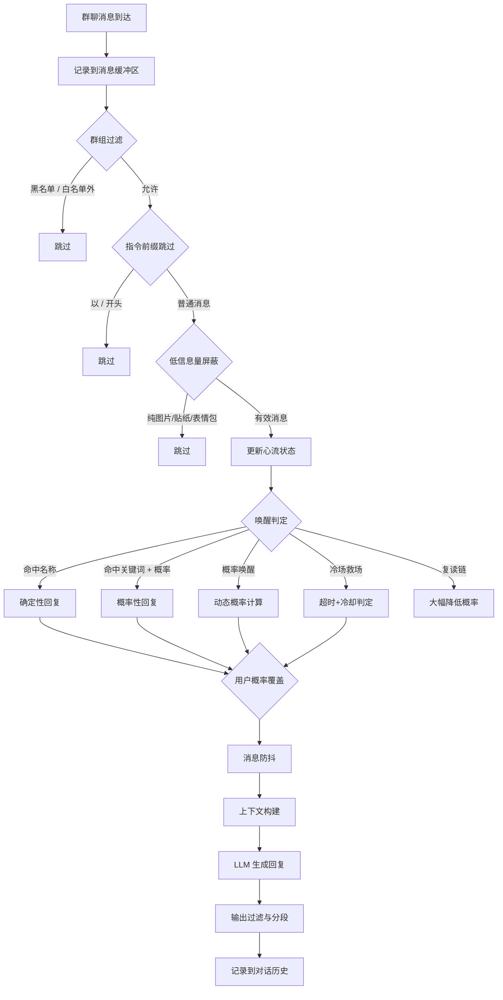

[English](README_EN.md) | 中文

# 灵犀

**心有灵犀，不唤自来**

唤名即应，投缘便聊；群冷场了就来，聊久了也会累—— 
由精力系统、心流状态、冷场救场与消息防抖默契配合而成的节律， 让 BOT 拥有了自然的社交呼吸。

[🌐 官网](https://magicalyuyu.github.io/astrbot_plugin_smart_wakeup/) · [📖 使用指南](docs/usage_guide.md) · [🚀 快速开始](#安装)

[-green?style=flat-square)](https://github.com/MagicalYuYu/astrbot_plugin_smart_wakeup)

---

## 它能做什么

- 🔔 **唤名即应** — 消息包含 Bot 名称即触发回复，多别名、大小写不敏感
- 💬 **投缘便聊** — 命中关键词或概率计算通过时自然加入话题，概率由精力×心流×参与度动态计算
- 🔇 **低信息量屏蔽** — 自动过滤纯图片、贴纸、表情包等无效消息，不浪费 Token 也不打断对话
- 😴 **累了就歇** — 精力系统模拟社交疲劳，回复消耗精力，随时间恢复，耗尽后静默旁观
- 🧊 **冷场救场** — 群聊停滞超时后主动参与，有冷却期防止频繁救场
- 🤚 **不会打断你** — 消息防抖等待用户说完再回复，聚合多条消息，不打断补充发言
- 🦜 **复读不打扰** — 检测复读链大幅降低回复概率，维护群友复读的快乐氛围
- 🧠 **记得聊过什么** — 分层对话记忆：近期保留原文 + 远期压缩摘要，支持多轮连贯对话
- 🖼️ **看得懂图片** — 图片上下文关联，理解图片内容避免上下文断裂；在场用户感知，避免幻觉提及不在场用户
- 💬 **知道谁在说话** — 上下文对话关系标注：BOT 发言标记、回复关系、隐式回应、省略主语提示
- 💰 **能省则省** — 上下文压缩、智能模型路由、Token 消耗追踪与异常告警
- ⌨️ **像真人分段说话** — 长回复智能分段发送，模拟输入节奏，末尾标点自然剔除
- 🛡️ **安全不出戏** — 兜底过滤思考标签、防止重复输出、群组过滤、指令前缀跳过、输出去重

<strong>完整功能一览</strong>

| 模块 | 说明 |
|:-----|:-----|
| 名称唤醒 | 消息包含 Bot 名称即触发回复，支持多别名（`\|` 分隔）、大小写不敏感 |
| 概率唤醒 | 未提及名称时按概率主动回复，概率由精力/心流/参与度动态计算，参与度采用平方曲线插值 |
| 精力系统 | 模拟社交疲劳——每次回复消耗精力，随时间恢复；精力耗尽则暂停主动发言 |
| 心流状态机 | 旁观 → 关注 → 心流 → 疲劳，四状态动态调整回复策略与概率 |
| 冷场救场 | 群聊冷场后主动参与对话，有冷却期防止频繁救场 |
| 消息防抖 | 等待用户停止发言后再回复，聚合多条消息，避免打断补充发言 |
| 复读抑制 | 检测复读链时大幅降低回复概率，避免打断群友的复读氛围 |
| 低信息量屏蔽 | 自动过滤纯图片/贴纸/表情包等无效消息，消息链级别检测，不浪费 Token |
| 指令前缀跳过 | 以 `/` 等前缀开头的系统指令不触发唤醒（回复 Bot 时除外） |
| 对话记忆 | 分层记忆：近期保留原文 + 远期压缩摘要，支持多轮连贯对话 |
| 图片上下文关联 | 让 Bot 理解图片内容，支持系统图片识别（零成本）和自定义多模态模型识别，两种模式互斥，默认关闭 |
| 在场用户感知 | 上下文中标注近期活跃用户列表，约束 Bot 只对在场用户说话，避免幻觉提及不在场用户，始终启用 |
| 对话关系标注 | BOT 发言标记 `[BOT]`、回复关系 `→ 回复[BOT]`、隐式回应 `(回应BOT)`、省略主语提示，始终启用 |
| 图片消息占位符 | 纯图片消息记录 `[图片]` 占位符，识别后更新为 `[图片: 描述]` |
| 上下文压缩 | 用小模型压缩群聊上下文再注入主模型，大幅减少 Token 消耗 |
| 智能模型路由 | 简单消息用小模型、复杂消息用大模型，支持级联升级（实验性） |
| 消息分段 | 长回复智能分段发送，模拟真人输入节奏，支持末尾标点剔除 |
| 输出去重 | 指纹去重机制，30 秒窗口内阻止重复内容发送，防止 LLM 工具调用导致重复输出 |
| 思考标签过滤 | 兜底过滤 LLM 回复中的思考内容，防止提示词泄露 |
| 用户概率覆盖 | 为特定用户自定义回复概率乘数（0=永不回复，0.5=减半，1=正常） |
| 单群参数覆盖 | 为特定群组自定义精力/心流/防抖等参数，未覆盖字段使用全局默认值 |
| Token 消耗追踪 | 实时统计 Token 用量，异常检测告警（σ 阈值 + Prompt 占比） |

## 安装

**插件市场（推荐）** — 在 AstrBot 插件市场搜索「灵犀」，点击安装。

**手动安装** — 将项目文件夹放入 AstrBot 的 `data/plugins/` 目录，重启 AstrBot 或在 WebUI 中启用插件。

## 快速配置

安装后在 **AstrBot WebUI → 插件管理 → 灵犀 → 配置** 中修改：

| 配置项 | 说明 | 必填 |
|:-------|:-----|:----:|
| `bot_name` | Bot 名称/别名，多个用 `\|` 分隔，如 `Bot\|小助手` | 是 |
| `probability_wakeup` | 概率唤醒开关，开启后未提及名称也有概率回复 | 否 |
| `splitter.enabled` | 消息分段开关，开启后长回复分段发送 | 否 |

其余配置项均有合理默认值，开箱即用。详细配置说明请参阅 [使用指南](docs/usage_guide.md)。

## 调试指令

所有指令仅管理员可用，在群聊中发送即可：

| 指令 | 说明 |
|:-----|:-----|
| `/wakeup_status` | 插件运行状态、统计、缓冲区概览 |
| `/wakeup_energy` | 当前群精力状态 |
| `/wakeup_flow` | 当前群心流状态 |
| `/wakeup_token` | Token 消耗统计 |

## 常见问题

插件支持哪些平台？

Telegram 和 QQ（通过 aiocqhttp 适配器接入）。两个平台功能一致，群 ID 格式不同：Telegram 群 ID 通常为负数，QQ 群 ID 为正数。

插件数据会持久化吗？

不会。所有运行时数据（消息缓冲区、精力/心流状态、对话历史等）存储在内存中，AstrBot 重启或插件重载后清空。这是设计意图——缓冲区仅用于提供近期上下文，无需持久化。

多个群可以独立配置吗？

可以。在「高级设置 → 单群参数覆盖」中为特定群设置独立参数，未覆盖的字段使用全局默认值。

如何完全关闭概率唤醒，只保留名称触发？

设置 `probability_wakeup = false`。此时 Bot 只在消息包含名称或关键词时才回复，不会主动参与对话。

Token 消耗太大怎么办？

1. 开启 `context_compression_enabled`（上下文压缩），用小模型压缩群聊上下文
2. 开启 `bypass_core_context`（绕过核心上下文），避免重复注入
3. 减小 `context_messages_count`（上下文消息数量）
4. 开启 `incremental_context_enabled`（增量注入），避免重复内容
5. 如有条件，配置独立的小模型用于压缩（`compression_model`）

Bot 回复太频繁 / 太沉默，怎么调？

**太频繁**：优先降低 `flow_flow_prob`（心流状态回复概率），其次提高 `energy_decay_rate`（精力消耗速率），让 Bot 更容易累。

**太沉默**：优先提高 `flow_bystander_prob`（旁观状态回复概率），其次降低 `energy_decay_rate`，让 Bot 不那么容易累。

每次只调一个参数，观察 1-2 天。更多调优建议见 [故障处理与调试指南](docs/troubleshooting_guide.md)。

为什么机器人没有回复？

排查步骤：
1. `/wakeup_status` 检查插件是否正常运行
2. `/wakeup_groups` 检查当前群是否被允许
3. 检查消息是否包含配置的机器人名称或关键词
4. 检查精力是否耗尽（`/wakeup_energy`）
5. 检查 AstrBot 日志是否有错误信息
6. 确认已配置 LLM 服务商

插件和 AstrBot 原生 @ 机制冲突吗？

不冲突。插件处理的是"自然唤醒"（名称/关键词/概率），AstrBot 原生的 @ 触发走独立通道。两者可以同时使用。

如何让 Bot 只在特定群生效？

在「群组过滤」中启用白名单，将目标群 ID 加入 `enabled_groups` 列表。未在白名单中的群不会触发任何唤醒。

分段后标点被去掉了怎么办？

分段模块默认剔除末尾的语气中性标点（句号、分号、冒号等），这是为了让回复更符合自然聊天习惯。如果不希望剔除：
1. 关闭 `strip_trailing_punct_enabled`
2. 或修改 `strip_trailing_punct_chars`，移除不想剔除的字符

## 前置条件

- AstrBot >= v4.5.0
- 已配置 Telegram 或 QQ（aiocqhttp）平台适配器
- 已配置 LLM 服务商
- 已配置人格设定（推荐）

## 文档

| 文档 | 说明 |
|:-----|:-----|
| [使用指南](docs/usage_guide.md) | 完整的配置说明、工作原理、场景行为矩阵 |
| [故障处理与调试指南](docs/troubleshooting_guide.md) | 故障排查流程、AI 辅助诊断、参数调优速查表、作者报备规范 |

## 工作原理

## 致谢与声明

本项目由 [MagicalYuYu](https://github.com/MagicalYuYu) 构思并主导开发，在 AI 辅助编程工具的协作下完成——核心设计决策与代码审查均由作者把控，AI 负责代码生成与迭代实现。感谢开源社区提供的工具与灵感。

## License

[AGPL-3.0](LICENSE)