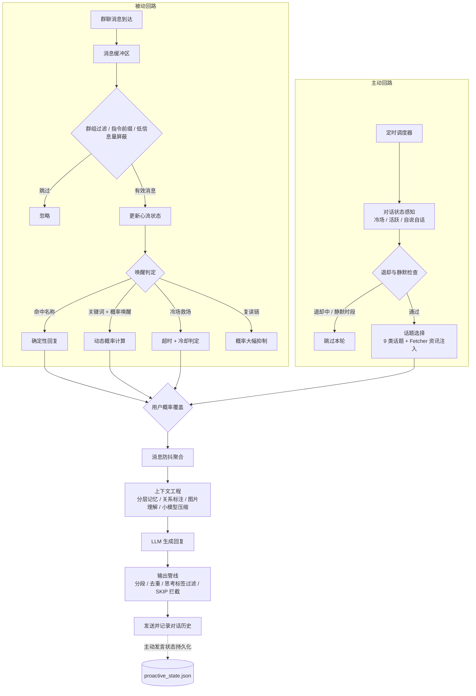

[English](README_EN.md) | 中文

# 灵犀 Lingxi

**心有灵犀，不唤自来**

会主动、知进退、有作息的群友型 Bot 节律引擎 
兼容 QQ（aiocqhttp）与 Telegram

[🌐 官网](https://lx.magicalyu.online/) · [📖 使用指南](docs/usage_guide.md) · [🚀 快速开始](#安装)

[-green?style=flat-square)](https://github.com/MagicalYuYu/astrbot_plugin_smart_wakeup)

---

大多数群机器人只有两种状态：被 @ 才应，不 @ 装死。灵犀让 Bot 成为真正的群友——它会主动发起话题、分享刚发生的资讯，聊嗨了全程在场，被无视时知趣收声，深夜到点睡觉。151 项参数与专属可视化面板，让它在你的每个群里都是不同的性格。

## 为什么做灵犀

群聊里的 Bot 大多有两种失败：一种是死——不 @ 就永远沉默；另一种是吵——没眼力见地刷屏插话。真人不是这样群聊的。真人有精力起伏，有聊嗨了的心流，也有察觉冷场后主动开口的瞬间，更有被无视后默默退开的自觉。灵犀把这套"社交节律"做成了引擎：精力、心流、参与度、时机、退却、作息——让 Bot 的每一次开口和每一次沉默都有理由。

## 它能做什么

**🗣️ 会主动**

- 🎯 **主动发起话题** — 基于 AIF（Anticipation-Initiation-Planning）三要素模型的主动发言引擎，定时感知群内氛围，该开口时才开口
- 📚 **9 类话题体系** — 分享想法 / 提问讨论 / 回忆过去 / 关注某人 / 活跃气氛 / 科技资讯 / 游戏八卦 / 沙雕新闻 / 热点事件，支持自定义话题与按群加权
- 📰 **刷资讯、发锐评** — Fetcher 模块实时抓取 RSS 与新闻 API（默认 15 个国内源、4 大类别），跨群资讯池去重，Bot 从信息索求者变成分享者
- 🎲 **防模板化开口** — 6 种开头模式池随机注入 + 话题去重 + 开头去重，主动发言不复读自己

**🧭 知进退**

- 🛑 **五路退却信号** — 群里聊得正嗨不插嘴 / 连续被无视就递进退让（首次无人回应仅延长冷却，连续 2/3/4 次递进退让 2h/6h/24h）/ 检测到"闭嘴""烦死了"自动潜水 / 自说自话占比过高自动收声
- 🌊 **社交呼吸四引擎** — 精力系统（会累）× 心流状态机（旁观/关注/心流/疲劳）× 参与度衰减 × 疲劳倍率，回复频率像真人一样有起伏
- 🔔 **唤名即应** — 叫名字必回（多别名、大小写不敏感），回复/引用 Bot 消息视为直接呼叫（含 Telegram 加一复读检测）
- 💬 **投缘便聊** — 概率唤醒：不提名字也按"精力 × 心流 × 参与度 × 时机"动态概率自然参与
- 🧊 **冷场救场** — 群内静默超时后出现新消息时主动暖场，带冷却与深夜静默约束
- 🤫 **真正的沉默权** — 回复抑制双方案：[SKIP] 关键词零成本拦截（前缀命中即整体拦截，防思考泄露）+ 独立小模型合规判别，不该说的话一句不说
- 🍃 **沉默也有在场感** — 轻量回应：被抑制时按概率回一句"确实""有道理"，概率 + 冷却 + 小时上限三重防刷屏
- 🦜 **复读不打扰** — 复读链检测（含部分子串、Telegram 加一），概率自动抑制，不打断群友的复读快乐
- 🌙 **有作息表** — 多段跨天静默时段（如 23:00-07:00,13:00-14:00），可按群覆盖适配海外时区，静默结束后渐进恢复

**🎛️ 可调校**

- 🖥️ **专属 Web 配置面板** — 非 schema 自动表单的独立面板：分组标签、实时状态 5 秒轮询、预设一键切换、测试发言、日志控制台、未保存提醒
- 🔧 **151 个可调参数** — 14 个配置分组，从精力恢复到话题权重全部可调
- 🎚️ **单群单人精调** — 21 项参数按群覆盖 + 用户级回复概率乘数（0 = 永不回复某人）
- 💰 **Token 精算师** — 上下文小模型压缩 + 增量注入 + 四维度 Token 统计（模型/群组/小时/唤醒类型）+ σ 异常告警，成本可控
- 🧠 **记得每个人说过什么** — 分层对话记忆（近期原文 + 远期摘要）+ 发送者归属 + 在场用户标注，不张冠李戴
- 🖼️ **看得懂图片** — 框架图片描述直取 + 自定义多模态模型降级识别双通道

## 主动发言引擎

v2.0 的核心跃迁：灵犀不再只会在被 @ 时才说话。

- **AIF 三要素模型** — 基于 Anticipation-Initiation-Planning（预判-发起-规划）的主动发言决策框架，状态机在 PASSIVE_MONITORING（旁观监测）与 AGENT_DOMINANT（主动主导）两态间切换
- **对话状态感知** — 实时识别群内冷场 / 活跃 / 自说自话状态，决定该不该开口
- **话题体系与资讯注入** — 9 类话题 + 自定义话题 + 按群加权；Fetcher 模块抓取 RSS（默认 15 个国内源、4 大类别）与新闻 API，跨群资讯池去重，让主动发言言之有物
- **退却与作息的自我保护** — 五路退却信号 + 递进退让 + 静默时段，主动发言绝不变成打扰
- **状态持久化** — 退却状态、冷却、每日计数写入 proactive_state.json，插件重载不丢
- **效果可度量** — 每群最近 20 条主动发言的 CPS（上下文契合度）与采纳率统计，`/wakeup_proactive_metrics` 随时可查

<strong>完整功能一览</strong>

| 模块 | 说明 |
|:-----|:-----|
| 主动发言引擎 | 基于 AIF（Anticipation-Initiation-Planning）三要素模型定时主动发起话题，与被动回复共享同一套记忆系统 |
| 对话状态感知 | 识别冷场 / 活跃 / 自说自话状态，为主动发言提供时机依据 |
| 话题体系 | 9 类内置话题（分享想法/提问讨论/回忆过去/关注某人/活跃气氛/科技资讯/游戏八卦/沙雕新闻/热点事件）+ 自定义话题 + 按群加权 |
| Fetcher 资讯抓取 | RSS（默认 15 个国内源、4 大类别）+ 新闻 API 双通道，跨群资讯池去重，支持自定义源 |
| 五路退却信号 | 活跃激增 / 连续 [SKIP] / 厌烦关键词 / 自说自话占比 / 连续无人回应，任一路触发即收声 |
| 递进退让 | 首次无人回应仅冷却加倍，连续 2/3/4 次递进退让 2h/6h/24h（退却时长上限可配置） |
| 静默时段 | 多段跨天静默时段（如 23:00-07:00,13:00-14:00），支持按群覆盖，适配海外时区 |
| 名称唤醒 | 消息包含 Bot 名称即触发回复，支持多别名（`\|` 分隔）、大小写不敏感 |
| 概率唤醒 | 未提及名称时按概率自然参与，概率由精力/心流/参与度动态计算，参与度采用平方曲线插值 |
| 精力系统 | 模拟社交疲劳——每次回复消耗精力，随时间恢复；精力耗尽则暂停主动发言 |
| 心流状态机 | 旁观 → 关注 → 心流 → 疲劳，四状态动态调整回复策略与概率 |
| 冷场救场 | 群聊冷场后主动参与对话，有冷却期防止频繁救场，受静默时段约束 |
| 消息防抖 | 等待用户停止发言后再回复，聚合多条消息，避免打断补充发言 |
| 轻量回应 | 回复被抑制时按概率回一句简短附和（"确实""有道理"），概率 + 冷却 + 小时上限三重防刷屏 |
| 回复抑制双方案 | [SKIP] 关键词前缀命中即整体拦截（零成本，防思考泄露）+ 独立小模型合规判别 |
| 复读抑制 | 检测复读链（含部分子串、Telegram 加一复读）大幅降低回复概率，维护群友复读的快乐氛围 |
| 低信息量屏蔽 | 自动过滤纯图片/贴纸/表情包等无效消息，消息链级别检测，不浪费 Token |
| 指令前缀跳过 | 以 `/` 等前缀开头的系统指令不触发唤醒（回复 Bot 时除外） |
| 对话记忆 | 分层记忆：近期保留原文 + 远期压缩摘要，主动发言与被动回复共享，支持多轮连贯对话 |
| 图片上下文关联 | 让 Bot 理解图片内容：框架图片描述直取为主（零成本）+ 自定义多模态模型降级识别兜底，默认关闭 |
| 在场用户感知 | 上下文中标注近期活跃用户列表，约束 Bot 只对在场用户说话，避免幻觉提及不在场用户，始终启用 |
| 对话关系标注 | BOT 发言标记 `[BOT]`、回复关系 `→ 回复[BOT]`、隐式回应 `(回应BOT)`、省略主语提示，始终启用 |
| 图片消息占位符 | 纯图片消息记录 `[图片]` 占位符，识别后更新为 `[图片: 描述]` |
| 上下文压缩 | 用小模型压缩群聊上下文再注入主模型，大幅减少 Token 消耗 |
| 辅助任务小模型分工 | 上下文压缩、合规判别等辅助任务可配置独立小模型，主模型专注对话生成，成本分层可控 |
| 消息分段 | 长回复智能分段发送，模拟真人输入节奏，支持末尾标点剔除 |
| 输出去重 | 指纹去重机制，60 秒窗口内阻止重复内容发送，防止 LLM 工具调用导致重复输出 |
| 发言防复读 | 6 种开头模式池随机注入 + 话题去重 + 开头去重 + 语义去重，主动发言不复读自己 |
| 思考标签过滤 | 兜底过滤 LLM 回复中的思考内容，防止提示词泄露 |
| Web 配置面板 | 专属可视化面板（10 条 REST API + 独立前端）：分组标签、实时状态 5 秒轮询、预设切换、测试发言、日志控制台 |
| 状态持久化 | 主动发言状态（退却/冷却/每日计数/UMO）持久化到 proactive_state.json，插件重载不丢 |
| 主动发言指标 | 每群最近 20 条主动发言的 CPS（上下文契合度）与采纳率统计 |
| 用户概率覆盖 | 为特定用户自定义回复概率乘数（0=永不回复，0.5=减半，1=正常） |
| 单群参数覆盖 | 21 项参数按群覆盖（精力/心流/防抖/主动发言/静默时段等），未覆盖字段使用全局默认值 |
| 私聊唤醒 | 支持私聊场景的名称/概率唤醒（按平台适配） |
| Token 消耗追踪 | 四维度统计（模型/群组/小时/唤醒类型），异常检测告警（σ 阈值 + Prompt 占比） |

## Web 配置面板

灵犀自带独立可视化配置面板，而非 schema 自动生成的冗长表单：

- **分组标签** — 151 项参数按 14 个配置分组组织，不再滚屏找参数
- **实时状态** — 5 秒轮询展示各群精力/心流/退却/发言计数
- **预设一键切换** — 内置预设快速切换整体性格
- **测试发言** — 面板内直接触发测试，调参即刻见效
- **日志控制台** — 最近日志实时查看，排查不用翻服务器
- **未保存提醒** — 关闭页面前检测未保存变更

入口：**AstrBot WebUI → 插件管理 → 灵犀 → 配置面板**。

## 安装

**插件市场（推荐）** — 在 AstrBot 插件市场搜索「灵犀」，点击安装，依赖自动处理。

**手动安装** — 将项目文件夹放入 AstrBot 的 `data/plugins/` 目录，安装依赖（`pip install -r requirements.txt`），重启 AstrBot 或在 WebUI 中启用插件。

## 快速配置

推荐使用**专属 Web 配置面板**（入口见上节），也可以在 **AstrBot WebUI → 插件管理 → 灵犀 → 配置** 中修改：

| 配置项 | 说明 | 必填 |
|:-------|:-----|:----:|
| `bot_name` | Bot 名称/别名，多个用 `\|` 分隔，如 `Bot\|小助手` | 是 |
| `probability_wakeup` | 概率唤醒开关，开启后未提及名称也有概率回复 | 否 |
| `proactive_speak.enabled` | 主动发言开关，开启后 Bot 会定时感知氛围主动发起话题 | 否 |
| `splitter.enabled` | 消息分段开关，开启后长回复分段发送 | 否 |

151 项参数均有合理默认值，开箱即用。详细配置说明请参阅 [使用指南](docs/usage_guide.md)。

## 调试指令

所有指令仅管理员可用，在群聊中发送即可：

| 指令 | 说明 |
|:-----|:-----|
| `/wakeup_status` | 插件运行状态、统计、缓冲区概览 |
| `/wakeup_energy` | 当前群精力状态 |
| `/wakeup_flow` | 当前群心流状态 |
| `/wakeup_token` | Token 消耗统计 |
| `/wakeup_buffer` | 当前群消息缓冲区内容 |
| `/wakeup_clear` | 清空当前群缓冲区与节律状态 |
| `/wakeup_groups` | 群组过滤状态与生效群列表 |
| `/wakeup_debounce` | 当前群消息防抖状态 |
| `/wakeup_proactive` | 手动触发一次主动发言（可指定资讯类别，如 `/wakeup_proactive 科技资讯`） |
| `/wakeup_proactive_status` | 主动发言状态：退却/冷却/每日计数/调度概览 |
| `/wakeup_proactive_metrics` | 主动发言效果指标：每群最近 20 条的 CPS 与采纳率 |

## 常见问题

如何让 Bot 主动说话？

开启 `proactive_speak.enabled`（主动发言开关），按需调整检查间隔、触发概率、话题方向等参数。也可用 `/wakeup_proactive` 手动触发一次试试效果。

为什么深夜 Bot 不主动发言？

这是静默时段机制在保护你的群。默认时段之外的配置见「静默时段」配置项，支持多段跨天（如 23:00-07:00,13:00-14:00）与按群覆盖，海外时区的群可以单独设置。

如何更换或添加 RSS 资讯源？

在 Fetcher 配置中编辑 RSS 源列表，支持三种自定义格式；默认内置 15 个国内源、4 大类别，开箱即用。详见 [使用指南](docs/usage_guide.md)。

插件支持哪些平台？

Telegram 和 QQ（通过 aiocqhttp 适配器接入）。两个平台功能一致，群 ID 格式不同：Telegram 群 ID 通常为负数，QQ 群 ID 为正数。

插件数据会持久化吗？

分两类：唤醒节律状态（消息缓冲区、精力/心流等）为内存态，AstrBot 重启或插件重载后重置——这是设计意图，缓冲区仅提供近期上下文；主动发言状态（退却/冷却/每日计数/UMO）自 v2.0 起持久化到 proactive_state.json，重载不丢。

多个群可以独立配置吗？

可以。21 项参数支持按群覆盖（精力/心流/防抖/主动发言/静默时段等），未覆盖的字段使用全局默认值——同一只 Bot 在不同群可以有不同性格。

如何完全关闭概率唤醒，只保留名称触发？

设置 `probability_wakeup = false`。此时 Bot 只在消息包含名称或关键词时才回复，不会主动参与对话。

Token 消耗太大怎么办？

1. 开启 `context_compression_enabled`（上下文压缩），用小模型压缩群聊上下文
2. 开启 `bypass_core_context`（绕过核心上下文），避免重复注入
3. 减小 `context_messages_count`（上下文消息数量）
4. 开启 `incremental_context_enabled`（增量注入），避免重复内容
5. 如有条件，配置独立的小模型用于压缩（`compression_model`）

Bot 回复太频繁 / 太沉默，怎么调？

**太频繁**：优先降低 `flow_flow_prob`（心流状态回复概率），其次提高 `energy_decay_rate`（精力消耗速率），让 Bot 更容易累。

**太沉默**：优先提高 `flow_bystander_prob`（旁观状态回复概率），其次降低 `energy_decay_rate`，让 Bot 不那么容易累。

每次只调一个参数，观察 1-2 天。更多调优建议见 [故障处理与调试指南](docs/troubleshooting_guide.md)。

为什么机器人没有回复？

排查步骤：
1. `/wakeup_status` 检查插件是否正常运行
2. `/wakeup_groups` 检查当前群是否被允许
3. 检查消息是否包含配置的机器人名称或关键词
4. 检查精力是否耗尽（`/wakeup_energy`）
5. 检查是否处于退却状态或静默时段（`/wakeup_proactive_status`）
6. 检查 AstrBot 日志是否有错误信息
7. 确认已配置 LLM 服务商

插件和 AstrBot 原生 @ 机制冲突吗？

不冲突。插件处理的是"自然唤醒"（名称/关键词/概率），AstrBot 原生的 @ 触发走独立通道。两者可以同时使用。

如何让 Bot 只在特定群生效？

在「群组过滤」中启用白名单，将目标群 ID 加入 `enabled_groups` 列表。未在白名单中的群不会触发任何唤醒。

分段后标点被去掉了怎么办？

分段模块默认剔除末尾的语气中性标点（句号、分号、冒号等），这是为了让回复更符合自然聊天习惯。如果不希望剔除：
1. 关闭 `strip_trailing_punct_enabled`
2. 或修改 `strip_trailing_punct_chars`，移除不想剔除的字符

## 前置条件

- AstrBot >= v4.16（< v5）
- 已配置 Telegram 或 QQ（aiocqhttp）平台适配器
- 已配置 LLM 服务商
- 已配置人格设定（推荐）

## 文档

| 文档 | 说明 |
|:-----|:-----|
| [官网 / 文档站](https://lx.magicalyu.online/) | 特性总览、在线演示与安装指引 |
| [使用指南](docs/usage_guide.md) | 完整的配置说明、工作原理、场景行为矩阵 |
| [故障处理与调试指南](docs/troubleshooting_guide.md) | 故障排查流程、AI 辅助诊断、参数调优速查表、作者报备规范 |
| [更新日志](CHANGELOG.md) | 版本演进与变更明细 |

## 工作原理

## 致谢与声明

本项目由 [MagicalYuYu](https://github.com/MagicalYuYu) 构思并主导开发，在 AI 辅助编程工具的协作下完成——核心设计决策与代码审查均由作者把控，AI 负责代码生成与迭代实现。感谢开源社区提供的工具与灵感。

## License

[AGPL-3.0](LICENSE)
