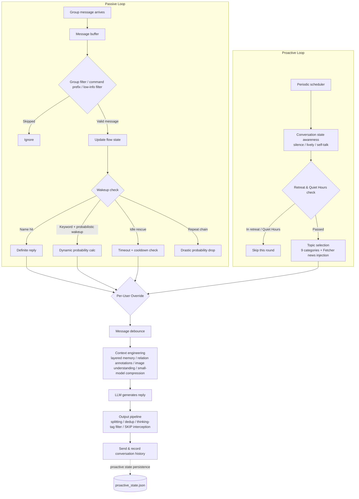

English | [中文](README.md)

# Lingxi

**Answers when called, speaks when it matters**

Turns your group bot into a real group member — proactive, tactful, and on a schedule 
Compatible with Telegram and QQ (aiocqhttp)

[🌐 Website](https://lx.magicalyu.online/) · [📖 Usage Guide](docs/usage_guide.md) · [🚀 Quick Start](#installation)

[-green?style=flat-square)](https://github.com/MagicalYuYu/astrbot_plugin_smart_wakeup)

---

Most group bots have only two states: answer when @-mentioned, or play dead otherwise. Lingxi turns your bot into a real group member — it starts topics on its own, shares fresh news, stays present when the chat heats up, backs off gracefully when ignored, and goes to sleep on schedule. With 151 tunable parameters and a dedicated visual config panel, it can have a different personality in every one of your groups.

## Why Lingxi

Group bots usually fail in one of two ways: they're dead — silent forever unless summoned — or they're noisy — barging in with zero social awareness. That's not how people chat. People have energy highs and lows, moments of flow, the instinct to break an awkward silence, and the tact to step back when ignored. Lingxi builds this "social rhythm" into an engine: energy, flow, engagement, timing, retreat, and rest hours — so every word the bot speaks, and every silence it keeps, has a reason.

## What It Does

**🗣️ Proactive**

- 🎯 **Starts Topics on Its Own** — Periodically senses the group atmosphere and speaks only when the moment is right
- 📚 **9 Topic Categories** — From sharing thoughts to trending news, with custom topics and per-group weighting
- 📰 **Reads the News, Drops Hot Takes** — Pulls RSS feeds and news APIs in real time, deduplicated across groups — your bot becomes a sharer, not just a taker
- 🎲 **Never Repeats Itself** — Multiple opener patterns, topic dedup, and opener dedup keep proactive speech fresh

**🧭 Tactful**

- 🛑 **Knows When to Back Off** — Backs off progressively when ignored, goes quiet on annoyance keywords, and stops talking to itself
- 🌊 **Social Breathing** — Energy drains and recovers, flow states rise and fall, reply frequency ebbs and flows like a real person
- 🔔 **Answers When Called** — Always replies to its name; replies and quotes count too
- 💬 **Joins When It Fits** — May join naturally via dynamic probability, like a group member who happens to be interested
- 🧊 **Saves Dead Chats** — Warmly restarts the conversation after silence, with a cooldown
- 🤫 **The Right to Silence** — Says nothing when nothing should be said — keyword blocking + small-model judgment
- 🍃 **Present While Silent** — Occasionally drops a "true" or "fair point" when suppressed — no spam, no vanishing
- 🦜 **No Repeat Interruption** — Probability drops sharply on repeat chains
- 🌙 **Has a Sleep Schedule** — Multi-segment quiet hours across midnight; per-group overrides for overseas time zones

**🎛️ Tunable**

- 🖥️ **Dedicated Config Panel** — Visual operation, no config file editing needed
- 🔧 **151 Tunable Parameters** — 14 config groups, from energy recovery to topic weights
- 🎚️ **Per-Group Tuning** — Each group can have a different personality and schedule
- 💰 **Token Control** — Small-model context compression, predictable costs
- 🧠 **Remembers the Conversation** — Layered memory shared by both proactive and passive speech
- 🖼️ **Understands Images** — Image content recognition

## Proactive Speech Engine

Lingxi no longer waits to be @-mentioned.

- **Conversation State Awareness** — Real-time detection of silence, liveliness, or self-talk to decide whether to speak
- **Topic System** — Share thoughts, ask questions, reminisce, care about someone, liven up the mood, plus tech/gaming/funny news and trending events — with custom topics and per-group weighting
- **News Injection** — Fetcher module pulls RSS and news APIs in real time with cross-group dedup, so proactive speech always has substance
- **Self-Protecting Retreat** — Five retreat signals plus quiet hours ensure proactivity never becomes a nuisance
- **Survives Reloads** — Retreat state, cooldowns, and daily counters persist to disk
- **Measurable Results** — Contextual pertinence score and adoption rate for each group's last 20 proactive messages, queryable via `/wakeup_proactive_metrics`

<strong>Full Feature List</strong>

| Module | Description |
|:-------|:------------|
| Proactive Speech Engine | Periodically starts topics based on group atmosphere; shares the same memory system as passive replies |
| Conversation State Awareness | Detects silence / lively / self-talk states to time proactive speech |
| Topic System | 9 built-in categories + custom topics + per-group weighting |
| Fetcher News Aggregation | RSS + news API dual channels, cross-group feed dedup, custom sources supported |
| Five Retreat Signals | Activity surge / consecutive SKIP / annoyance keywords / self-talk ratio / consecutive no-response — any one silences the bot |
| Progressive Retreat | First no-response doubles cooldown; repeated no-responses escalate (duration configurable) |
| Quiet Hours | Multiple cross-midnight quiet periods, per-group overrides, overseas time-zone friendly |
| Name Wakeup | Triggers when a message contains the bot's name or aliases, case-insensitive |
| Probabilistic Wakeup | May reply even without being named; probability dynamically computed from energy, flow, and engagement |
| Energy System | Simulates social fatigue — each reply costs energy, which recovers over time |
| Flow State Machine | Bystander → Attentive → Flow → Fatigued — four states dynamically adjust reply strategy |
| Idle Rescue | Steps in when the group chat goes quiet, with cooldown, subject to Quiet Hours |
| Message Debounce | Waits for users to finish speaking before replying, aggregating multiple messages |
| Lightweight Responses | When suppressed, occasionally drops a short acknowledgment, guarded by probability + cooldown + hourly cap |
| Dual Reply Suppression | Keyword prefix match blocks the entire reply + independent small-model compliance judgment |
| Repeat Suppression | Detects repeat-copy chains and lowers reply probability, preserving group repeat culture |
| Low-Information Filter | Filters out pure images, stickers, and emoji-only messages, saving tokens |
| Command Prefix Skip | Messages starting with `/` won't trigger wakeup (unless replying to the bot) |
| Conversation Memory | Layered memory: recent turns verbatim + older turns summarized, shared by both paths |
| Image Context | Framework image descriptions first + custom multimodal model fallback, off by default |
| Active User Awareness | Annotates recently active users in context, constraining the bot to present users only |
| Conversation Annotations | Bot speech marked `[BOT]`, reply relations, implicit responses, omitted-subject hints |
| Image Placeholder | Pure image messages recorded as `[Image]`, updated to `[Image: description]` after recognition |
| Context Compression | Compresses group chat context with a smaller model before main-model injection |
| Small-Model Offloading | Auxiliary tasks like compression and compliance use a dedicated small model |
| Message Splitting | Splits long replies into natural segments with realistic pacing |
| Output Dedup | Fingerprint-based dedup with a 60-second window |
| Anti-Self-Repeat | Multiple opener patterns + topic/opening/semantic dedup |
| Think-Tag Filter | Strips LLM thinking content from replies as a safety net |
| Web Config Panel | Visual panel: grouped tabs, live status polling, preset switching, test-speak, log console |
| State Persistence | Proactive-speech state persisted to disk, survives reloads |
| Proactive Metrics | Contextual pertinence score and adoption rate per group |
| Per-User Override | Custom reply probability multipliers for specific users (0 = never reply) |
| Per-Group Override | Multiple parameters overridable per group; unoverridden fields use global defaults |
| Private Chat Wakeup | Name/probability wakeup in private chats |

## Web Config Panel

Lingxi ships with a dedicated visual config panel — not an auto-generated schema form:

- **Grouped Tabs** — 151 parameters organized into 14 config groups, no more endless scrolling
- **Live Status** — 5-second polling shows each group's energy / flow / retreat / message counters
- **One-Click Presets** — Built-in presets to switch the overall personality instantly
- **Test-Speak** — Trigger a test message right from the panel and see tuning take effect immediately
- **Log Console** — Recent logs viewable in place, no need to SSH into the server
- **Unsaved-Changes Warning** — Detects unsaved changes before closing the page

Entry point: **AstrBot WebUI → Plugin Management → Lingxi → Config Panel**.

## Installation

**Plugin Marketplace (recommended)** — Search for "Lingxi" in the AstrBot plugin marketplace and click Install; dependencies are handled automatically.

**Manual** — Place the project folder into AstrBot's `data/plugins/` directory, install dependencies (`pip install -r requirements.txt`), then restart AstrBot or enable the plugin in the WebUI.

## Quick Setup

The dedicated **Web Config Panel** is recommended (see above), or configure via **AstrBot WebUI → Plugin Management → Lingxi → Settings**:

| Setting | Description | Required |
|:--------|:------------|:--------:|
| `bot_name` | Bot name/aliases, `\|`-separated, e.g. `Bot\|Assistant` | Yes |
| `probability_wakeup` | Enable probabilistic wakeup — the bot may reply even without being named | No |
| `proactive_speak.enabled` | Enable proactive speech — the bot periodically senses the atmosphere and starts topics | No |
| `splitter.enabled` | Enable message splitting — long replies are sent in natural segments | No |

All 151 parameters have sensible defaults and work out of the box. For detailed configuration, see the [Usage Guide](docs/usage_guide.md) (Chinese).

## Debug Commands

Admin-only commands, sent in group chat:

| Command | Description |
|:--------|:------------|
| `/wakeup_status` | Plugin status, statistics, buffer overview |
| `/wakeup_energy` | Current group energy state |
| `/wakeup_flow` | Current group flow state |
| `/wakeup_token` | Token usage statistics |
| `/wakeup_buffer` | Current group message buffer contents |
| `/wakeup_clear` | Clear the current group's buffer and rhythm state |
| `/wakeup_groups` | Group filter status and effective group list |
| `/wakeup_debounce` | Current group message debounce state |
| `/wakeup_proactive` | Manually trigger one proactive message (optional news category, e.g. `/wakeup_proactive tech`) |
| `/wakeup_proactive_status` | Proactive speech status: retreat/cooldowns/daily counters/schedule overview |
| `/wakeup_proactive_metrics` | Proactive speech metrics: CPS and adoption rate over each group's last 20 messages |

## FAQ

How do I make the bot speak proactively?

Enable `proactive_speak.enabled`, then tune the check interval, trigger probability, topic preferences, etc. as needed. You can also run `/wakeup_proactive` to trigger one manually and see how it feels.

Why doesn't the bot speak proactively late at night?

That's the Quiet Hours mechanism protecting your group. See the "Quiet Hours" settings for periods beyond the defaults — multiple cross-midnight periods are supported (e.g. `23:00-07:00,13:00-14:00`) along with per-group overrides, so groups in overseas time zones can be configured separately.

How do I change or add RSS news sources?

Edit the RSS source list in the Fetcher configuration — three custom formats are supported; 15 built-in Chinese sources across 4 categories work out of the box. See the [Usage Guide](docs/usage_guide.md) for details.

Which platforms are supported?

Telegram and QQ (via the aiocqhttp adapter). Both platforms have identical functionality; group IDs differ in format — Telegram group IDs are typically negative numbers, QQ group IDs are positive.

Is data persisted?

Two categories: wakeup-rhythm state (message buffers, energy/flow, etc.) is in-memory and resets on AstrBot restart or plugin reload — this is by design, since the buffer only provides recent context; proactive-speech state (retreat/cooldowns/daily counters/UMO) has been persisted to proactive_state.json since v2.0 and survives reloads.

Can different groups have different settings?

Yes. Multiple parameters support per-group overrides (energy/flow/debounce/proactive speech/Quiet Hours, etc.); unoverridden fields fall back to global defaults — the same bot can have a different personality in each group.

How do I disable probabilistic wakeup and keep name-trigger only?

Set `probability_wakeup = false`. The bot will only reply when its name or keywords are mentioned — no proactive participation.

Token usage is too high — what can I do?

1. Enable `context_compression_enabled` — compresses group chat context with a smaller model
2. Enable `bypass_core_context` — avoids duplicate injection
3. Reduce `context_messages_count` — fewer messages in context
4. Enable `incremental_context_enabled` — avoids re-injecting content
5. If possible, configure a dedicated small model for compression (`compression_model`)

The bot replies too often / too rarely — how to adjust?

**Too active**: Lower `flow_flow_prob` (flow-state reply probability) first, then increase `energy_decay_rate` (energy cost per reply) so the bot tires faster.

**Too quiet**: Raise `flow_bystander_prob` (bystander-state reply probability) first, then lower `energy_decay_rate` so the bot doesn't tire as easily.

Adjust one parameter at a time and observe for 1–2 days. For more tuning tips, see the [Troubleshooting & Debug Guide](docs/troubleshooting_guide.md) (Chinese).

Why isn't the bot replying?

Troubleshooting steps:
1. `/wakeup_status` — check if the plugin is running
2. `/wakeup_groups` — verify the current group is allowed
3. Check if the message contains the configured bot name or keywords
4. Check if energy is depleted (`/wakeup_energy`)
5. Check whether it's in retreat or Quiet Hours (`/wakeup_proactive_status`)
6. Check AstrBot logs for errors
7. Confirm an LLM provider is configured

Does this conflict with AstrBot's native @-mention mechanism?

No. This plugin handles "natural wakeup" (name/keyword/probability), while AstrBot's native @-trigger uses a separate channel. Both can coexist.

How do I limit the bot to specific groups?

Enable the whitelist under "Group Filtering" and add target group IDs to `enabled_groups`. Groups not on the whitelist won't trigger any wakeup.

Punctuation is being stripped from split messages — how to stop that?

The splitting module strips trailing neutral punctuation (periods, semicolons, colons, etc.) by default to make replies feel more natural in chat. To disable:
1. Turn off `strip_trailing_punct_enabled`
2. Or modify `strip_trailing_punct_chars` to remove characters you want to keep

## Prerequisites

- AstrBot >= v4.16 (< v5)
- A configured Telegram or QQ (aiocqhttp) platform adapter
- A configured LLM provider
- A configured persona (recommended)

## Documentation

| Document | Description |
|:---------|:------------|
| [Website / Docs](https://lx.magicalyu.online/) | Feature overview, live demo, and install guide |
| [Usage Guide](docs/usage_guide.md) | Full configuration, how it works, scenario behavior matrix (Chinese) |
| [Troubleshooting & Debug Guide](docs/troubleshooting_guide.md) | Fault diagnosis, AI-assisted debugging, parameter tuning, issue reporting (Chinese) |
| [Changelog](CHANGELOG.md) | Version history and change details (Chinese) |

## How It Works

## Acknowledgments

This project was conceived and led by [MagicalYuYu](https://github.com/MagicalYuYu), developed in collaboration with AI-assisted coding tools — all core design decisions and code reviews were handled by the author, with AI handling code generation and iterative implementation. Thanks to the open-source community for the tools and inspiration.

## License

[AGPL-3.0](LICENSE)
